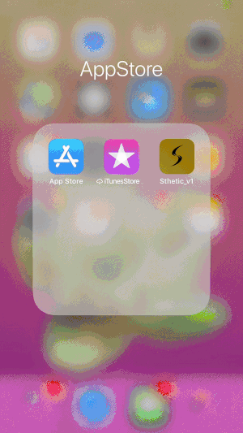
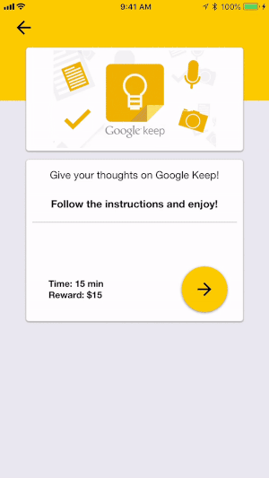

# Sthetic React Native App
React Native App for remote UI/UX design usability testing. Backend implemented using Firebase.

<!-- .element style="height: 300; width: 300" -->

Getting AWS Credentials -Ask Admin (Sean or Baiyu) to create new IAM User -Open Email from AWS with link to sign in with aws account, login with iam username and credentials csv -Install aws-cli -Run 'awsmobile config' follow prompts with credentials -Run 'awsmobile init ' with project id from awsmobilehub on browser console

-run npm Install

-run awsmobile run
